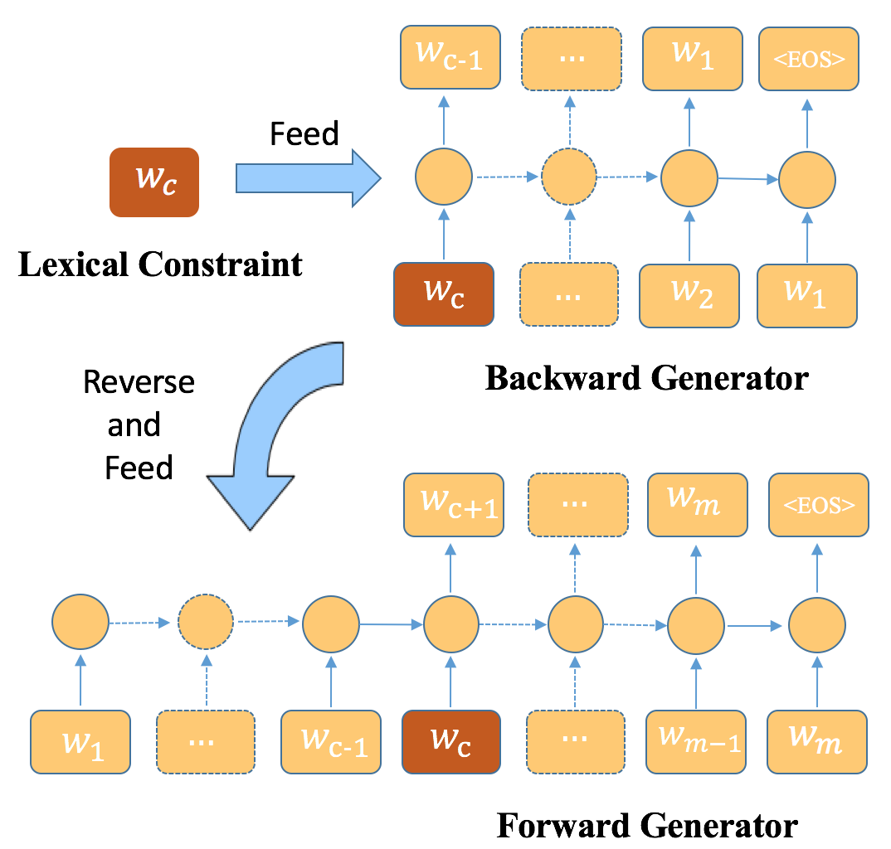

# BFGAN: Backward and Forward Generative Adversarial Networks for Lexically Constrained Sentence Generation

This repo contains the code and data of the following paper:
>**BFGAN: Backward and Forward Generative Adversarial Networks for Lexically Constrained Sentence Generation**. 
*Dayiheng Liu, Jie Fu, Qian Qu, Jiancheng Lv*, arXiv 2019

# Overall

 

We propose a new algorithmic framework, dubbed BFGAN, to achieve Lexically Constrained Sentence Generation. Specifically, we employ a backward generator and a forward generator to generate lexically constrained sentences together, and use a discriminator to guide the joint training of two generators by assigning them reward signals.
 
**We will release the code and data upon acceptance.**  
